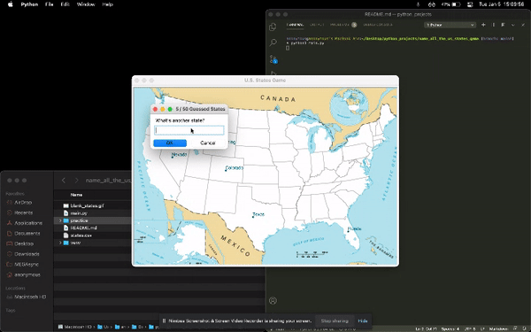

# name_all_the_us_states_game

In your terminal run python3 main.py\
If you enter the special / key words in prompt below...

- 'quit', 'answers' or 'print' forfeits the game, prints answers to screen and creates a csv file of missed states
- 'exit' or 'bye' terminates the game

